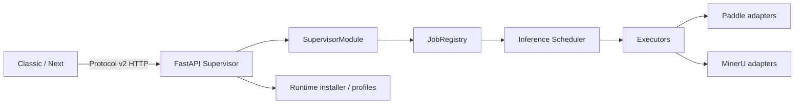

<div align="center">

# VibeOCR Backend

**无 UI、本地优先的 OCR / PDF 运行时与 Supervisor 服务**

[](https://github.com/FelixJI/vibeocr-backend/actions/workflows/ci.yml)
[](https://github.com/FelixJI/vibeocr-backend/releases/latest)
[](pyproject.toml)
[](.ci/project.json)
[](LICENSE)

[定位](#项目定位) · [架构](#架构) · [开发](#开发与验证) · [源码导读](docs/source-reading-guide.md) · [贡献](CONTRIBUTING.md)

</div>

VibeOCR Backend 是 Classic 与 Next 共用的本地计算组件：它通过 FastAPI/Uvicorn Supervisor 暴露
Protocol v2 API，管理 OCR/PDF job、模型调度、运行时安装与 CPU/CUDA 12.6 profile。

> [!IMPORTANT]
> 本仓库没有桌面 UI。普通用户应从 VibeOCR Classic 或 Next 的 Release 开始；前端通过绑定的
> VibeOCR Protocol 与已验证的 Backend Release 通信。

## 项目定位

Backend 负责：

- 本地 Supervisor 的启动、认证、ready/bootstrap 与健康检查；
- OCR、PDF、二维码等 job 的提交、观察、取消和结果交付；
- 推理 scheduler、executor 与 Paddle/MinerU 等 adapter 的编排；
- CPU/CUDA 运行时 profile 的安装、验证和资产身份绑定；
- 向前端提供稳定的 Protocol v2 HTTP 边界。

Backend 不负责桌面窗口、WebView 或用户工作流编排，这些职责属于 Classic/Next。

## 架构



Supervisor 是进程与协议边界；application/services 负责用例编排；adapter 隔离具体引擎。PocketBase、
桌面 UI 或 Web 前端都不应成为本仓库的数据权威或展示职责。

## 一条真实请求链

提交 job 时，请求从 `supervisor/app.py` 的 `POST /v2/jobs` 进入，随后经过
`SupervisorModule.submit`、`JobRegistry` 与 executor，最终到达 composite/Paddle/MinerU adapter。
进度与结果通过 `/v2/jobs/{job_id}/observe` 获取，控制命令通过 `/v2/jobs/command` 提交。

这也是初学者最值得先读的纵向链，详见 [源码阅读指南](docs/source-reading-guide.md)。

批量请求可在一个 job 中提交多个文件，但合并传输不等于引擎原生批量推理。默认 RapidOCR 逐图调用，
并复用已加载模型；可选 Paddle OCR 才支持一次处理多张图。Supervisor 对计算批次设有资源预算，
同一设备上的推理经调度器依次取得租约。RapidOCR 在 CPU 上默认给每个 ONNX Runtime session
分配最多 8 个线程（不足 8 个逻辑核时按核数），inter-op 为 1；显式 RapidOCR 参数优先，
自定义 `config_path` 保留其配置；无法取得逻辑核数时沿用 RapidOCR 上游默认值。
线程预算只调整运行资源，不改变识别模型或输出契约。

## MinerU 4 配置与运行时边界

Backend 的 MinerU 依赖固定为正式 4.0.2，使用 `mineru.parser.api_server` 的
`/v1/health`、uploads → parse/jobs → files；取消任务使用 `DELETE /v1/parse/jobs/{id}`。
成功文件与失败文件分别交付，partial 不伪装为全批成功。输出下载并转换后清理本次创建的文件；
未确认取消终态时保留输入，交由上游过期机制处理。服务重启或资源不足不会切换 tier。

| 旧设置 | 新行为 |
| --- | --- |
| 缺省、hybrid-engine / medium | basic，保持产品默认 |
| hybrid-engine / high | standard |
| pipeline、vlm-engine、xhigh、关闭公式/表格、多语言 | 返回迁移错误，要求重新选择 |
| 0-based 起止页 | 转为 1-based 页范围；缺省全页，不截取前 10 页 |
| typed mineru 配置 | 保留 flash/basic/standard/advanced、ocr_mode、page_range 和单 language |

非 PDF 仅接受全文件，向上游省略 page_range。language 属服务级设置，不作为逐 job 参数；
不同语言的任务在服务重启、解析和下载期间串行隔离。原生 Office 文档可能由上游使用无模型提取，
不能据此宣称扫描 OCR 或 GPU 加速已验证。

结果正文从原生 middle 语义节点提取，不把 structured Markdown 当纯文本再包装；代码说明和脚注保留。
现有 VibeOCR block 模型将行内字体样式、链接和嵌套列表层级扁平化为可读文本；
图片/图表识别正文（含其中的 HTML 表格）同样投影为可读文本，保留内容但不提供嵌入表格编辑；
原生 structured block 保存在 source 中，独立表格仍走既有结构化表格合同，不宣称原样保留全部 Office 排版。
Word/Excel 导出保留上述回退正文与附属文字；Word 嵌入可用图片，Excel 沿用文本汇总中的图片占位说明。

新配置保存于 `MINERU_HOME/config.yaml`，也支持显式 `MINERU_CONFIG`；安装器为新版本提供独立
MinerU home，不覆盖旧 `mineru.json` 或旧模型。默认 `model.small_backend: onnx`、
`model.vlm.engine: llama-cpp`；cu126 profile 额外安装 `[torch]`，只有显式选择
`small_backend: torch` 才使用该小模型路径。默认不安装 `[full]` / LMDeploy。
模型继续由 MinerU 原生机制和已选模型源管理，不关闭 TLS 校验。

`ocr.mineru-config.v1` 目录分别报告 tier 的准备状态。包已安装、HTTP health 成功均不足以标记 ready；
当前进程必须实际完成该 tier 的准备解析。准备结果不跨 Supervisor 重启保留；失败不降为 flash。
客户端须先按正式 Protocol 公布的生命周期能力完成准备，再重新读取目录、构造 typed 请求。

Paddle 与 Base/RapidOCR/MinerU 使用不同解释器及 site-packages：Paddle 位于 runtime 的
`engines/paddle`，独立锁固定其 OpenCV contrib 和框架，主环境使用 OpenCV Python。
两个环境在同一未激活安装候选中构建并分别执行 `pip check`，任一失败不替换原有效 runtime；
Paddle 推理经私有子进程调用，主进程不导入 Paddle。独立组件选择与确认流程见下文“安装预览与独立组件”。

## 仓库地图

```text
packages/                         # 可发布 Python packages
└── vibeocr-backend/
    └── src/vibeocr/backend/
        ├── supervisor/           # FastAPI、job registry、scheduler、进程入口
        ├── application/          # 用例与 facade
        ├── services/             # OCR/PDF 服务编排
        └── adapters/             # Paddle、MinerU 等实现边界
scripts/
├── bootstrap-ci.ps1              # 锁定依赖与组件输入
├── check-quality.ps1             # 质量入口
└── automation.py                 # CI/发布稳定接口
tests/                            # 单元、协议、安装器与 smoke 测试
.ci/project.json                  # profile、门禁、构建与发布契约
```

实际 package 布局可能随模块拆分演进；定位入口时以 `pyproject.toml` 的 scripts 与 `rg --files` 为准。

## CLI 入口

| 命令 | Python 入口 | 用途 |
| --- | --- | --- |
| `vibeocr-supervisor` | `vibeocr.backend.supervisor.main:main` | 启动本地 Supervisor |
| `vibeocr-runtime-installer` | `vibeocr.backend.runtime_installer:main` | 安装与验证运行时 profile |

Supervisor 由前端按组件锁和 handshake 管理。除调试外，不建议绕过前端手工拼接启动参数。

## 开发与验证

需要 Windows、[uv](https://docs.astral.sh/uv/) 和仓库锁定的 Python：

```powershell
git clone https://github.com/FelixJI/vibeocr-backend.git
cd vibeocr-backend
uv venv --seed .venv
$env:VIRTUAL_ENV = (Resolve-Path .venv).Path
$env:Path = "$env:VIRTUAL_ENV\Scripts;$env:Path"
uv run --no-sync powershell -NoProfile -File scripts/bootstrap-ci.ps1
uv run --no-sync powershell -NoProfile -File scripts/check-quality.ps1
```

完整 CI 还会执行 Protocol conformance、release build、manifest 与 installer smoke。精确命令及 profile
输入以 [`.ci/project.json`](.ci/project.json) 为准。

> [!NOTE]
> 真实模型、CUDA、安装器与 frozen package 验证会下载或构建较大资产。普通逻辑修改先运行相邻单元测试；
> 只有涉及 profile、模型 adapter、打包或安装边界时才需要对应重型 smoke。

## Runtime 与 Protocol 边界

- Protocol capability 决定前端可用功能，不以版本号猜测行为。
- ready 表示 Supervisor 协议边界可用，不等于所有模型已经加载。
- 运行时 profile、manifest 与组件 identity 由发布自动化生成并验证。
- 本地开发不能通过 editable/path dependency 绕过已发布 Protocol/Backend 组件关系。

## 安装预览与独立组件

正式 Protocol 2.8.3 的 `runtime.install-plan.v1` 支持 HTTP `POST /v2/runtime/install-plan`
与冷启动 Host `request_kind: install_plan`。先协商 capability，再预览设备、请求/有效组件、
保留/安装/替换/移除项和阻断原因；预览不安装包或创建维护 operation。成本尚未解析时返回
`null` 与原因，不用包数量或压缩大小冒充实际下载/磁盘成本。

确认使用同一 `plan_id` 和显式 `operation_id`，不能同时覆盖选择。计划有效期10分钟，
安装写锁内校验来源及安装基线；过期或状态变化要求重新预览。已完成 operation 的同请求
重放返回原收据。失败后重试需新计划和新的 operation ID；旧的无计划 API 仍可使用。

Paddle-only 使用 Base 主环境和独立 Paddle 环境，不强装 MinerU/Torch；MinerU-only 不装
Paddle。CUDA MinerU 才依赖 Torch `gpu_runtime`。省略组件选择的重启保留已有引擎意图，
显式空集合选择 Base；CPU/CUDA 切换映射同一引擎。候选环境全部校验后才切换，旧环境保留，
跨环境只复用目标锁接受的下载 artifact，不共享 `site-packages` 或删除模型。最终体积与
真实识别能力由各引擎的实际验收确定。

## 发布

正式 Release 由 CI/CD 生成并绑定源码 SHA、组件 identity、精确资产集合、SHA-256 与 SPDX SBOM。
版本只能通过仓库自动化更新；不要直接修改派生版本、tag 或 Release 资产。

## 参与贡献

先阅读 [`CONTRIBUTING.md`](CONTRIBUTING.md) 与 [源码阅读指南](docs/source-reading-guide.md)。行为变化应在
相邻测试中覆盖成功与实际相关的失败/取消路径；提交使用 Conventional Commit。

## 许可证

本项目基于 [LICENSE](LICENSE) 中的条款发布。


## 在线依赖解析的超时诊断

解析阶段保留 30 分钟总上限，并在连续 5 分钟没有新的包状态或字节进展时停止。
网络连接/读取超时为 30 秒，连接重试和中断下载续传各最多 2 次；维护心跳只表示进程仍在运行，
不会重置无进展时限。持续进展允许超过空闲窗口，但仍受总时限约束。

`runtime.resolve_packages` 的活动事件和错误保留操作标识、来源 id、耗时、距最后活动的时间及脱敏尾部。
`total_timeout` 表示阶段总时限，`idle_timeout` 表示无有效进展，`exit_nonzero` 的尾部区分 pip 报告的网络错误或解析冲突。
取消和失败只清理该次操作的子进程树，不替换先前验证可用的运行环境；旧服务恢复不代表本次安装成功。

pip 的 `--dry-run --report` 也可能传输 wheel；本地受控 HTTP 回归已经证明这一点，但不能据此推断用户现场发生了重复下载。
未取得现场完整版本与日志时，应保留“当前实现可复现、原现场原因待确认”的边界。

## 维护下载进度与恢复

`maintenance.v2` 的事件沿用正式 Protocol 2.8.3 字段。阻塞解析、HEAD 和下载前发布步骤；
`message_args.step` / `package` 标识当前下载工作，`elapsed_seconds` 是操作经过时间，
`last_activity_seconds` 是距最后有效活动的时间。心跳不增加字节或重置有效活动计时。

下载 `progress.unit=bytes` 仅统计当前下载批次新收到的 artifact 字节，不包含已验证缓存，
也不是整个安装或 pip resolver 的总网络流量。只有可信长度已知时提供 `total`；未知长度、
HEAD/GET 长度不一致时省略总量，不伪造百分比或 ETA。收到全部字节后还须通过锁中既有摘要
验证，才发送 `runtime.download_verified`；此时安装、组件验证和激活仍可能未完成。

`runtime.download_cache_hit` 的 `cache_bytes` 是复用量，不计网络量；损坏缓存和版本不匹配
重新下载，共享缓存允许 Paddle/MinerU 两种安装顺序复用已验证 artifact。`runtime.already_satisfied`
表示目标运行环境已满足。维护成功的 `model_readiness=not_checked` 明确安装器未准备或验证模型；
模型状态继续由既有模型 API 表达，不能由缓存命中或服务 ready 推断。

失败/取消事件保留 `reason_code`、`next_action`、操作/阶段/来源及有界脱敏诊断，重启后通过
operation observe/replay 查询；普通 inspect 不覆盖之前的维护结果。已识别的原因包括
`network_timeout`、`network_error`、`http_error`、`hash_mismatch`、`disk_full`、`permission_denied`、
`total_timeout`、`idle_timeout`、`process_exit_nonzero` 和 `component_verification_failed`。
无法可靠归因的约束、ABI、驱动等错误保留诊断并标为 `unknown` 或对应失败步骤，不猜具体根因。
取消关闭本次 HTTP 连接和子进程，清理本次 `.part`，保留有效缓存和旧运行环境；重试重新下载未完成
artifact，不承诺 HTTP 断点续传。已有 operation 幂等、单 writer、终态不可回退规则保持有效。
