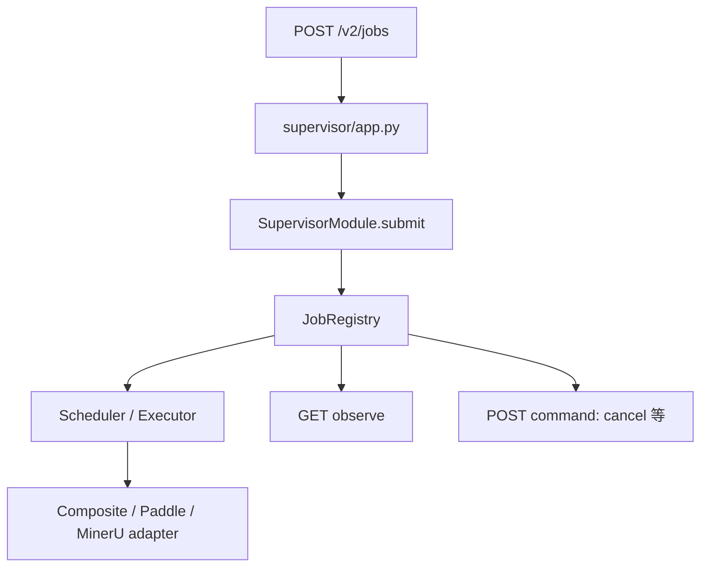

# VibeOCR Backend 源码阅读指南

本指南面向想理解 VibeOCR 本地运行时的初学者。建议先掌握 Supervisor 的协议边界，再进入 OCR/PDF
引擎；从模型 adapter 反向阅读，容易错过 job 生命周期、认证和调度约束。

## 先建立四层模型

1. **Supervisor/API**：进程启动、认证、ready、Protocol v2 routes。
2. **Application/Services**：把请求转成用例和稳定的内部接口。
3. **Jobs/Scheduler/Executors**：管理状态、排队、取消和资源使用。
4. **Adapters**：Paddle、MinerU、PDF、二维码等具体实现。

前端只依赖第一层的正式协议，不应知道 adapter 的内部结构。

## 15 分钟启动链

按这个顺序阅读：

1. `pyproject.toml`：找到 `vibeocr-supervisor` 与 `vibeocr-runtime-installer` entry point。
2. `supervisor/main.py`：理解 CLI 参数、Uvicorn 与进程生命周期。
3. `supervisor/composition.py`：查看依赖如何组装。
4. `supervisor/app.py`：浏览 routes 与 FastAPI lifespan。
5. `supervisor/bootstrap.py`、`supervisor/auth.py`：理解 ready/bootstrap 和本地认证边界。
6. 对照 Supervisor 相关测试，确认端口、token、错误与关闭语义。

## 第一条纵向链：提交一个 job



阅读时记录每一层输入和输出：

- API 在哪里验证 Protocol contract、auth 与 capability？
- `SupervisorModule.submit` 如何选择 job 类型或执行器？
- `JobRegistry` 保存哪些状态，谁可以改变它们？
- 排队、运行、成功、失败、取消如何转换？
- observe 返回的是快照、事件还是长轮询结果？
- adapter 异常怎样变成稳定的协议错误？

然后在 tests 中搜索 route、job id、状态名和错误码，至少读一条成功、一条失败或取消测试。

## 第二条纵向链：ready 与 capability

前端启动 Backend 后必须先完成 ready/bootstrap handshake：

1. 从 `supervisor/main.py` 找到 ready envelope 的输出位置。
2. 追踪 `bootstrap.py` 如何收集版本、profile 和 capabilities。
3. 查看 `auth.py` 如何限定本地客户端访问。
4. 对照 VibeOCR Protocol 的 bootstrap/capability 定义。
5. 阅读测试中缺失、未知或不兼容 capability 的处理。

牢记：进程 ready 表示服务边界可以接受请求，不代表重型模型已全部加载。

## 按方向深入

### OCR 与 PDF 用例

从 `application` 或 `services` 的 facade 开始，先理解稳定接口，再进入 `adapters`。重点分清：

- 输入规范化与引擎调用；
- 页级/任务级结果聚合；
- 可取消边界；
- 临时文件和最终结果的所有权；
- 可复现错误与引擎特有错误的映射。

### Job 与并发调度

从 `JobRegistry`、scheduler 和 executor 读起。不要只看 happy path；取消、异常、并发上限和进程关闭
更能体现状态机不变量。

### Runtime installer

从 `vibeocr-runtime-installer` entry point 进入，沿 profile/manifest → 下载或本地资产 → 验证 → 安装状态
阅读。不要把发布资产复制到临时用户目录，也不要通过关闭杀软或宽泛排除绕过问题。

### 新增引擎 adapter

先找现有 adapter 的最小接口与测试 seam，再接入具体 SDK。不要让 engine-specific 类型穿透到 API，
也不要在 route 中直接调用模型。

### 构建与发布

按 `.ci/project.json` → `scripts/automation.py` → CI workflow 的顺序阅读。profile、manifest、build identity
和 installer smoke 是一个整体，不能只更新其中一份派生文件。

## 测试策略

按风险逐步扩大：

1. 修改模块的纯单元测试；
2. Supervisor route/job registry 的聚焦测试；
3. Protocol conformance；
4. 仅在相关时运行真实模型、CUDA、installer 或 frozen package smoke；
5. PR CI 的完整 release build/smoke。

开发环境与仓库质量入口：

```powershell
uv venv --seed .venv
$env:VIRTUAL_ENV = (Resolve-Path .venv).Path
$env:Path = "$env:VIRTUAL_ENV\Scripts;$env:Path"
uv run --no-sync powershell -NoProfile -File scripts/bootstrap-ci.ps1
uv run --no-sync powershell -NoProfile -File scripts/check-quality.ps1
```

不要用系统 `pip` 拼装依赖；仓库使用 uv 与锁定配置。具体测试参数以 `.ci/project.json` 为准。

## 常见误区

- **从 Paddle/MinerU 开始读**：先理解 Supervisor 与 job 生命周期。
- **把 Backend 当桌面应用**：UI 和用户工作流属于 Classic/Next。
- **ready 等同于模型已加载**：ready 只承诺协议边界可用。
- **在 route 中堆业务逻辑**：稳定用例应进入 application/services。
- **用版本号替代 capability**：前端与 Backend 应按 Protocol 协商。
- **为文档或小逻辑改动下载全部模型**：先运行相邻测试，重型验证只在相关边界使用。
- **使用邻仓 editable dependency**：发布链通过组件锁和 identity 绑定正式输入。

## 读完后的自检

你应该能回答：

- Supervisor 从 CLI 到 FastAPI app 如何组装？
- 一个 job 怎样进入 registry、executor 和 adapter？
- observe、command 与取消分别在哪里实现？
- ready、模型加载完成和 capability 有什么区别？
- 哪类改动需要真实 runtime/installer smoke？

回答这些问题后，优先选择 route 校验、job 状态或一个小 service 的聚焦修改作为第一个 PR。
